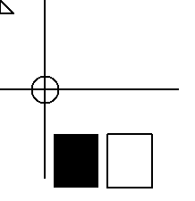
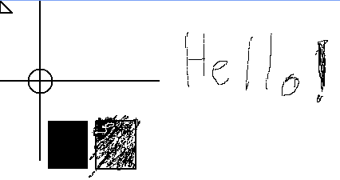
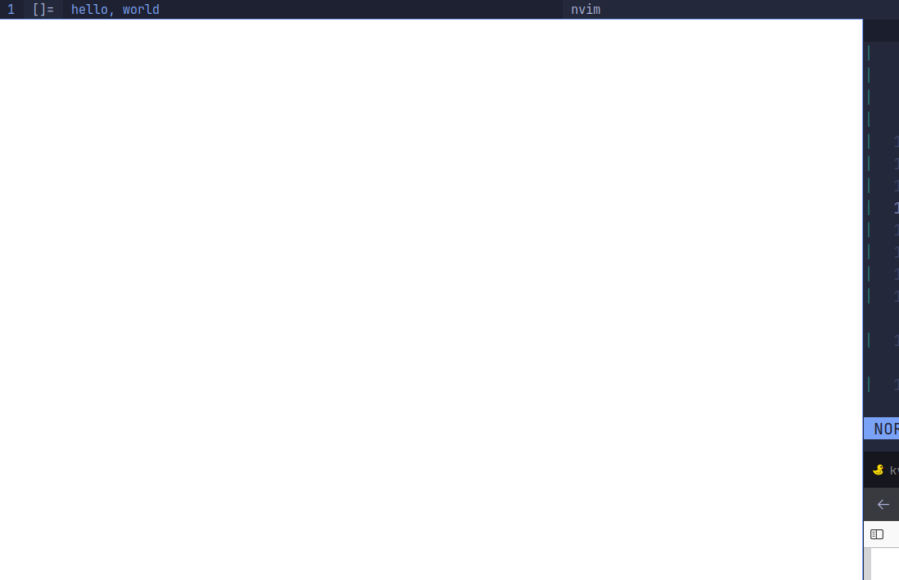

# xlib

### Most of them are from Guy Keren's ["Basic Graphics Programming With The Xlib Library"](https://ftp.dim13.org/pub/doc/Xlib.pdf).

### simple-drawing.c



### events.c



### simple-text.c


### simple-wm-hints.c

Integrates well with dwm, but I don't have patch allowing me to display icons. On Qtile it doesn't show icon either.



### window-operations.c

It moves!

https://github.com/piotr-marendowski/xlib/assets/37738748/a5ec9498-ac7a-4f72-ad01-5ef023636934

### Compile and run

```
gcc -g -o out simple-drawing.c -lX11 && ./out
```

Don't see any need for a Makefile.
