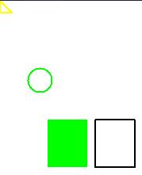
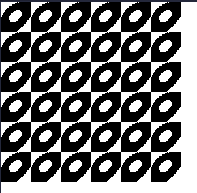

# xlib

### Most of them are from Guy Keren's ["Basic Graphics Programming With The Xlib Library"](https://ftp.dim13.org/pub/doc/Xlib.pdf).

### simple-drawing.c


### events.c


### simple-text.c


### simple-wm-hints.c

Integrates well with dwm, but I don't have patch allowing me to display icons. On Qtile it doesn't show icon either.


### window-operations.c

It moves around!

### color-drawing.c



### draw-pixmap.c

It needs to be .xbm (I exported it from GIMP)



### cursor.c

Changes cursor to icon.xbm

### Compile and run

```
gcc -g -o out simple-drawing.c -lX11 && ./out
```

Don't see any need for a Makefile.
